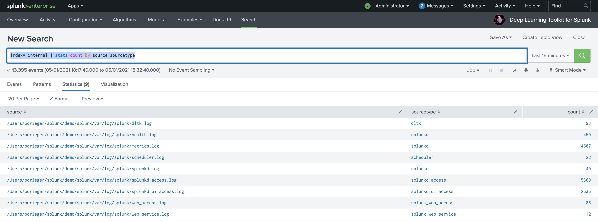
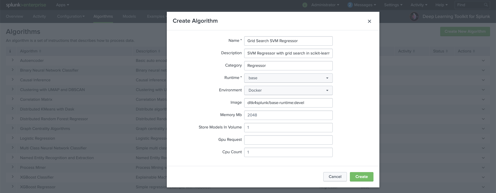
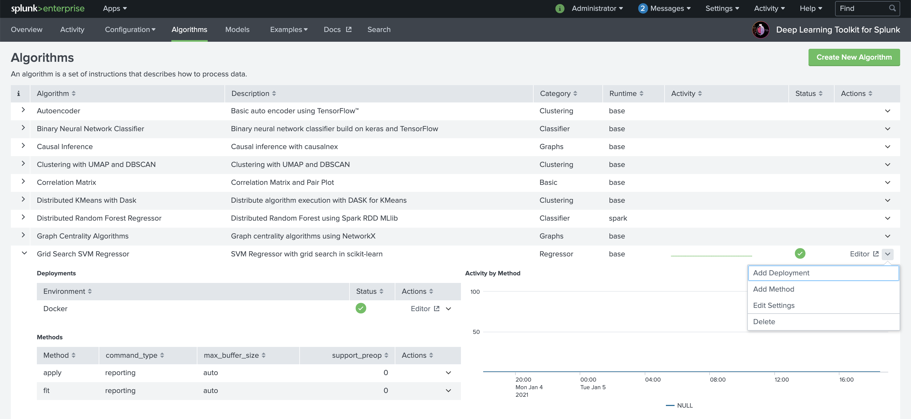
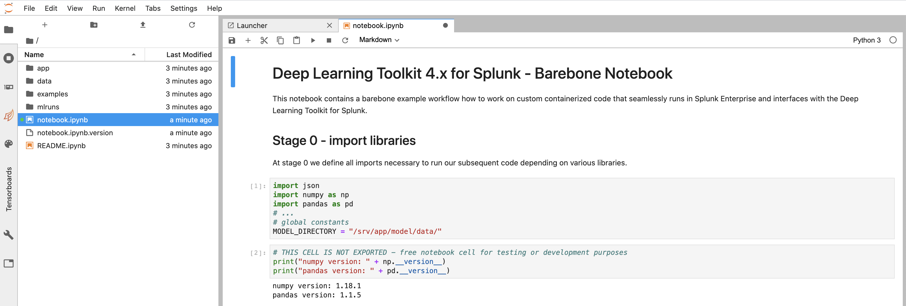

# User Guide for Base Runtime 

This guide provides you with the essential steps for creating custom models that use the **base** runtime.

## General Information
### Predefined workflow with Splunk SPL and your custom model code
DLTK's JupyterLab Notebooks are seamlessly integrated with Splunk's Search Processing Language (SPL) by using the `compute` command. Your custom model code is dynamically computed in a container over a predefined interface. For a minimal set of implementing a DLTK based machine learning model typically implements functions like fit, apply or summary which are exposed via python functions in your notebook. Those functions act as entry points for your code that can be easily developed in the notebook cells.

### Automatic generation of Python Modules
If you derive your notebook from the available DLTK 4.x barebone template or the existing examples (recommended way) you take advantage of an automation how your developed model code will seamlessly be interfaced with DLTK's `compute` command in SPL and your defined fit, apply and summary commands. As soon as you save your Jupyter notebook, all relevant cells that contain the predefined functions are automatically exported into a Python module. This file is located in the /app/model folder and will then be called dynamically from your fit, apply and summary command. With that your models are always kept up to date with your latest model developments. Feel free to integrate this methodology to your existing CI, CD, versioning or other DevOps workflows.

### Naming Convention
Important Note: Please take care that your changes in model code are available at the next call of your model which might be triggered by a scheduled search or ad hoc when users work with your models. Therefore you need to take care about your development workflow, e.g. using a robust naming conventions that clearly separate models in development from those in production. Please keep in mind that you work with python compatible, `lower_case_and_underscore` names in general to avoid naming conflicts. 

## Step by Step Guide

### 0. Data Selection and Setup (DLTK > Search)
Search and identify the data in Splunk that you are looking to develop a model on.
From this dataset consider the features of the data that would be important for the model build, using SPL with filters, evals and stats commands as appropriate.

### 1. Create New Algorithm (DLTK > Algorithms)
Make sure that Deep Learning Toolkit is up and running. You can verify that by running one of the algorithm examples for the **base** image.

Navigate to DLTK's algorithms page and `Create New Algorithm` from the top right of the page. Enter the *name*, *description* and *category* of your algorithm. Select `base` as Runtime and select the target environment if you want to deploy the algorithm automatically.

As soon as your algorithm is successfully deployed you can access JuypterLab with the `Editor` button on the right.

The default PW for DLTK's JupyterLab in the base image is `Splunk4DeepLearning`. You can change authentication and security options by building your own DLTK container and use them for your deployments.

Open the notebook.ipynb file from the root notebooks folder and make yourself familiar with its structure. By default it contains a barebore structure of typical steps that you can implement for your custom model. Please see the explanation in the notebook and have a look at existing other algorithms to learn from those examples.

Important note again: please use no spaces but only underscore _ separators in your notebook and model names to avoid errors caused by spaces in file and model names!

### 2. Send Sample Data to Deployed Algorithm (DLTK > Search)
From your Splunk search you can send a data sample to Jupyter Lab model development using ` ... | compute mode=stage algorithm="Your cool new algorithm" environment="Docker" method="fit" fields="source,sourcetype,count" feature_variables="source,sourcetype" target_variables="count"`. Note that the parameter `mode=stage` just sends the data sample to JuypterLab **without** actually running any declared `method`. It is indicating that you wish to transfer a dataset over to the container to be worked on in the JupyterLab environment. In most cases you will start with a simple small dataset of a given structure of features and not with millions of datapoints in the very first place. This helps you to speed up on typical data science iteration cycles for drafting your model.

Hint: you can also use search sampling in Splunk or the `... | sample` command from MLTK to retrieve a randomly sampled subset of your data.

### 3. Develop Notebook Code (DLTK > Algorithms > Editor > Jupyter Lab)
Write your model code in the JupyterLab notebook created in step 1, testing that it operates on the data sent over to the container in step 2. Take advantage of Jupyter notebooks to interactively execute parts of your code and rapidly develop your modelling ideas.
Note that you may wish to resend a different subset of your data during this code development phase if the original sample does not contain enough records or features for testing purposes. Once you are satisfied that your code is operating as expected make sure to save the notebook.
Once saved, you can check that the corresponding .py module file reflects the core code of your notebook correctly and does not contain typical Python indendation or other spelling errors which will break during runtime.

Hint: have a look at existing algorithms examples

### 4. Train Model (DLTK > Search)
In case of creating a supervised model you typically split your data in SPL into a training set and a testing set, e.g. by using the `... | sample` command with `partitions` and `seed` options for consistent sampling: `... | sample partitions=10 seed=42 | where partition_number<7`
Run the `... | compute` command for your algorithm on the training dataset using ` ... | compute algorithm="Your cool new algorithm" environment="Docker" method="fit" fields="source,sourcetype,count" feature_variables="source,sourcetype" target_variables="count" model_name="my_first_dltk_model"` ensuring that you are passing in the correct features and also parameters this time. You can pass any `key="value"` based parameters which will be exposed in the parameters of your `fit` and `apply` functions in your notebook. If it runs successfully the training results should be returned to you. In the case of errors check the job inspector and the `search.log`, noting that you may need to return to stage 3 to update the code. Additionally, if you have access to splunk `_internal`logs, you can also search in DLTK for `index=_internal sourcetype=dltk` to see if any deployment issues exist.

### 5. Inspect and validate Model (DLTK > Algorithms > Editor > Jupyter Lab)
Depending on your machine learning frameworks of choice you can use tools like *TensorBoard* (available within Jupyter Lab as widget) to check and validate how your model evolved over its training epochs etc.
Check histograms and other insights provided in TensorBoard or with the help of visualization libraries in Jupyter Lab like matplotlib or seaborn etc. to further improve or tune your model.

### 6. Test Model (DLTK > Search)
Select the test dataset by partitioning the data again, for example using `... | sample partitions=10 seed=42 | where partition_number>=7` or simply using new data with the time picker in search.
This time apply the model on the test dataset, for example using ` ... | compute algorithm="Your cool new algorithm" environment="Docker" method="apply" fields="source,sourcetype,count" feature_variables="source,sourcetype" model_name="my_first_dltk_model"`
In the case of errors check the job inspector and the search.log, noting that you may need to return to stage 3 to update the code. Additionally, if you have access to splunk `_internal`logs, you can also search in DLTK for `index=_internal sourcetype=dltk` to see if any deployment issues exist.
To evaluate and score your model, you can use the `... | score` command from MLTK to evaluate the accuracy of the model using relevant metrics, for example a classification report or confusion matrix for a classification algorithm or R squared and RMSE for a regression or forecast algorithm. Alternatively, you can also do the scoring in your notebook.
### 7. Iterate, Refine or Retrain Model (DLTK > Search or DLTK > Algorithms > Editor > Jupyter Lab)
Once the model is tested and achieves good results you are likely to revisit your model from time to time to adapt to new data situations or business requirements with regards to:
- improve your model code
- retrain it with new data (including concepts of partial fit)
- iterate otherwise in your model development

### 8. Operationalize Model (DLTK > Search)
Once the model is performing to an acceptable standard, create an alert, report or dashboard to monitor new data as it is coming into Splunk using the `... | compute ...` command on the data features identified with the trained model.
Monitor your model performance and results including keeping track of metrics and alert on model degradation
Implement human in the loop feedback loops to incorporate human intelligence into your models and constantly improve and adapt to new situations.

